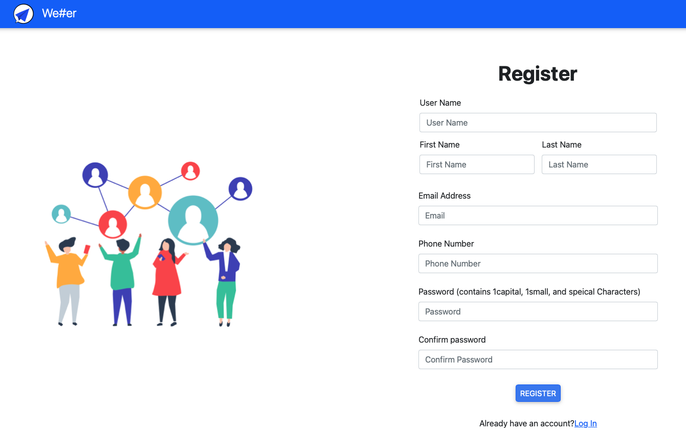
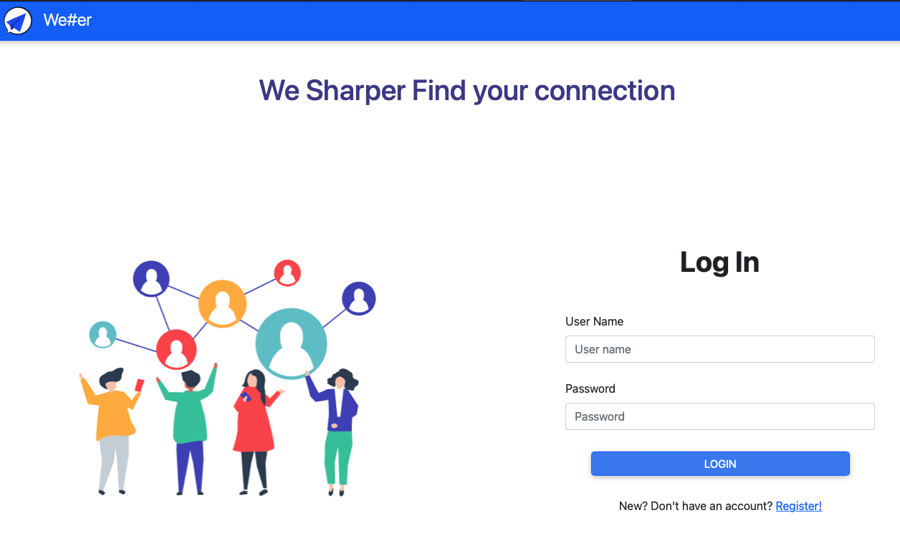
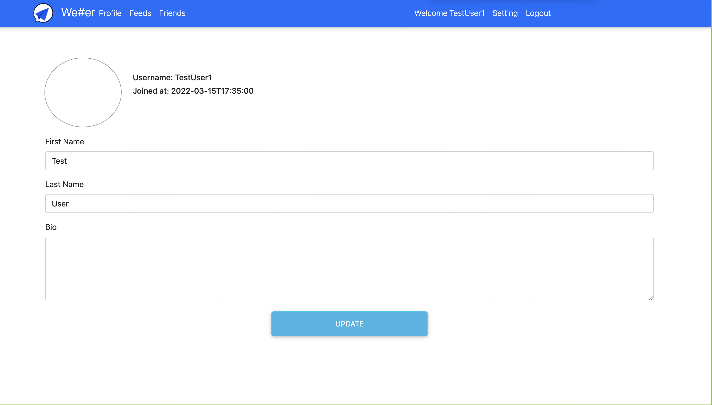
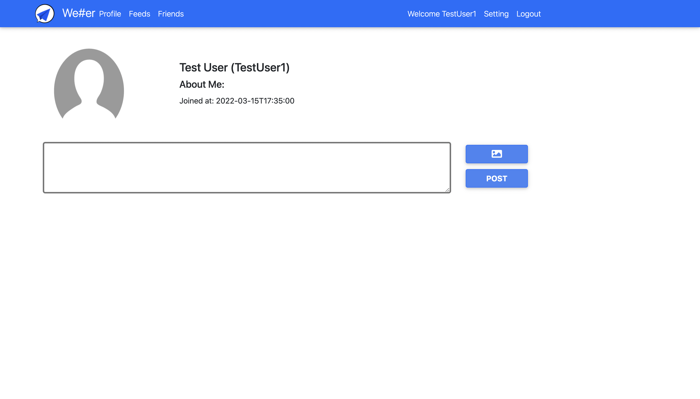
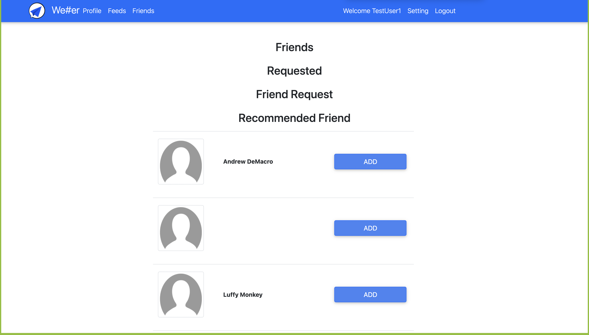
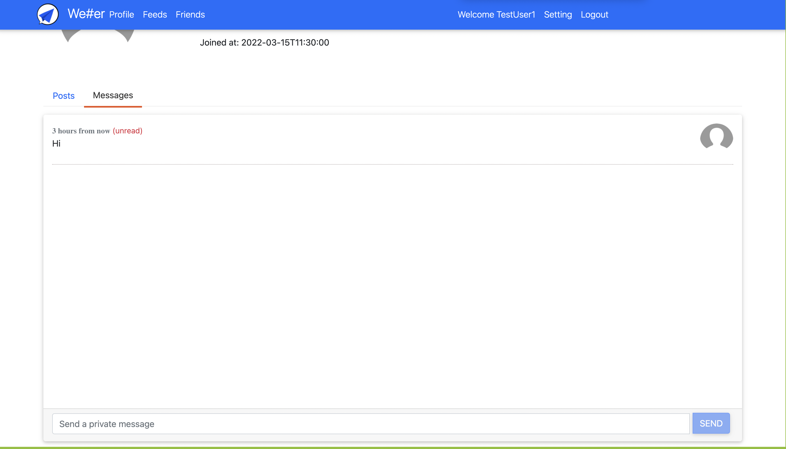

# We#er(WeSharper) - Project 2 - Revature 

# Introduction
WeSharper is a web based social media application for connecting and communicating with your friends. The app will recommend new friends for you to add and connect with. Users are able to post text with image updates to a feed viewable to all friends. You also can have the real time chat and share some good news with your friends!

# Table of Contents
- [We#er(WeSharper) - Project 2 - Revature](#weerwesharper---project-2---revature)
- [Introduction](#introduction)
- [Table of Contents](#table-of-contents)
- [Features](#features)
- [Technologies](#technologies)
  - [Backend](#backend)
  - [Frontend](#frontend)
  - [Others](#others)
- [Getting started](#getting-started)
  - [Register](#register)
  - [Login](#login)
  - [Edit Profile](#edit-profile)
  - [Create a Post](#create-a-post)
  - [Add friend](#add-friend)
  - [RealTime Chat with friends](#realtime-chat-with-friends)
- [Changelog](#changelog)
  - [v1.0.0](#v100)
- [Contributors](#contributors)
- [Contributing & Issues](#contributing--issues)
- [License](#license)

# Features
- Register
- Login
- Update Profile Information
- Upload/Update Profile Picture
- Post New Post(Text, Image, Text & Image)
- Delete Your Post
- See Your Posts
- See List of Friends(Friends, Requested Friends, Friend Requests, Recommended)
- Accept/Remove/Cancel/Add Friend
- See Your Friend Profile
- See Your Friend Posts
- See New Feeds(Friends's Posts)
- Realtime message chat With your friends
- Receive notification when you receive a new message

# Technologies
## Backend
- [C#](https://docs.microsoft.com/en-us/dotnet/csharp/tour-of-csharp/)
- [LINQ](https://docs.microsoft.com/en-us/dotnet/csharp/programming-guide/concepts/linq/)
- [JSON](https://www.json.org/json-en.html)
- [ADO.NET](https://docs.microsoft.com/en-us/dotnet/framework/data/adonet/ado-net-overview)
- [xUnit](https://xunit.net)
- [SeriLog](https://serilog.net)
- [Azure SQL Server](https://azure.microsoft.com/en-us/services/sql-database/campaign/)
- [Entity Framework Core](https://docs.microsoft.com/en-us/ef/core/)
- [ASP.NET Core Web APIs](https://dotnet.microsoft.com/en-us/apps/aspnet/apis)
- [ASP.NET Identity](https://docs.microsoft.com/en-us/aspnet/identity/overview/getting-started/introduction-to-aspnet-identity)
- [Azure Blob Storage](https://azure.microsoft.com/en-us/services/storage/blobs/)
- [ASP.NET SignalR](https://docs.microsoft.com/en-us/aspnet/core/signalr/introduction?view=aspnetcore-6.0)
- [Swagger](https://swagger.io)
  
## Frontend
- [Angular](https://angular.io)
- [Nodejs](https://nodejs.org/en/)
- [Typescript](https://www.typescriptlang.org)
- [Javascript](https://www.javascript.com)
- [ASP.NET SignalR](https://docs.microsoft.com/en-us/aspnet/core/signalr/introduction?view=aspnetcore-6.0)
- [HTML](https://www.w3schools.com/html/)
- [CSS](https://www.w3schools.com/css/)
- [Bootstrap](https://getbootstrap.com)
- [FontAwesome](https://fontawesome.com/)
- [JSON](https://www.json.org/json-en.html)
  
## Others
- [Visual Studio Code](https://code.visualstudio.com)
- [DBeaver](https://dbeaver.io)
- [Git](https://git-scm.com)
- [GitHub](https://github.com)
- [SonarQube](https://www.sonarqube.org)
- [Markdown](https://daringfireball.net/projects/markdown/)
- [Moqups](https://moqups.com)

# Getting started
## Register
> To join our application you will first register by filling out the registration form.

## Login
> Input your username and password to login.
 

## Edit Profile
> Go to "Settings" to edit your profile and add a profile photo.

## Create a Post
> Go to "Profile" to create a new post with text and image.

## Add friend
> Go to "Friends" to add/accept/delete your friendslist as well as view your friend's profile.

## RealTime Chat with friends
> Go to your friend's profile and click on "Messages" to chat with your friend in realtime!

<h2>

  To experience our application for yourself, along with more features not listed above, please visit: [https://wesharperweb.azurewebsites.net/](https://wesharperweb.azurewebsites.net/)

# Changelog
## v1.0.0
- Release

# Contributors
- [Jasmine Tseng](https://github.com/JasmineTseng7)
- [Hyunsoo Jeon](https://github.com/hsprime85)
- [Nabintou Fofana](https://github.com/NabintouSFofana)
- [Matthew Chan](https://github.com/naruto7878)
- [Tuan Anh Nguyen](https://github.com/kirasn)
  
# Contributing & Issues
We made this project for the course, so if you would like to suggest more features or have issue with the installation, please contact us by [opening an issue](https://github.com/220118-Reston-NET/WeSharper-P2/issues) to leave your feedback!

We appreciate every contributions or ideas to make the app better.

# License
N/A

[Back To Top](#weerwesharper---project-2---revature)